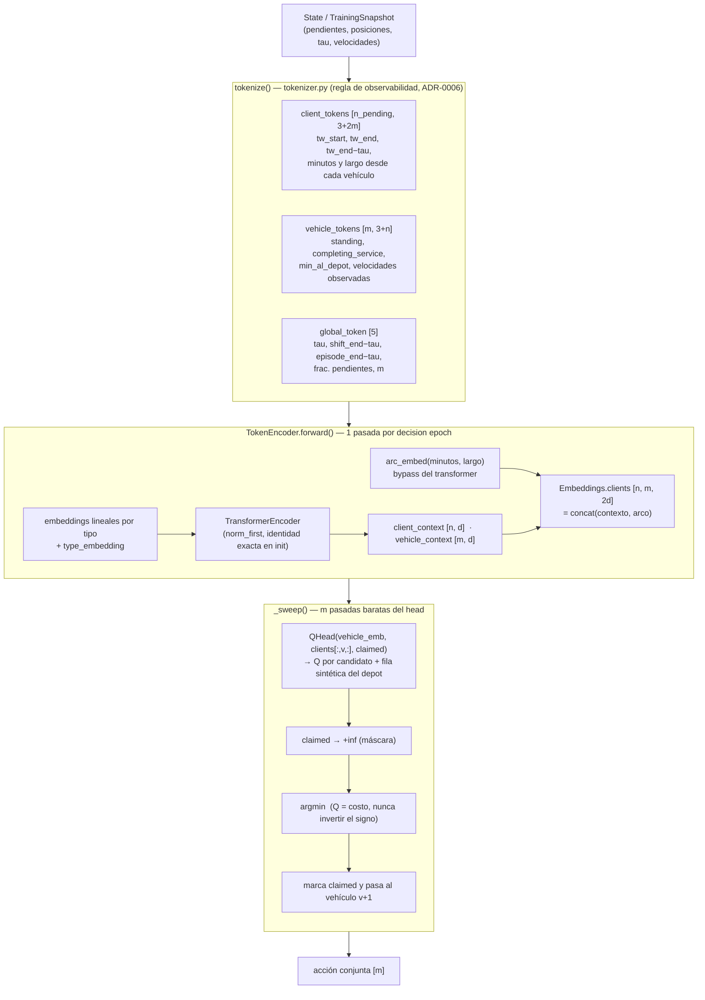
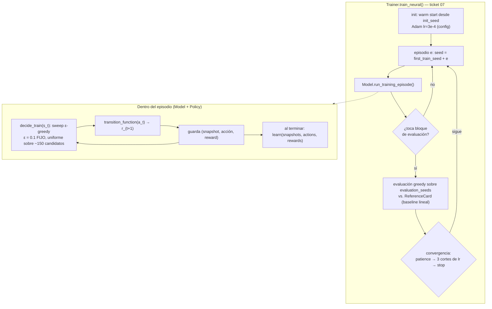
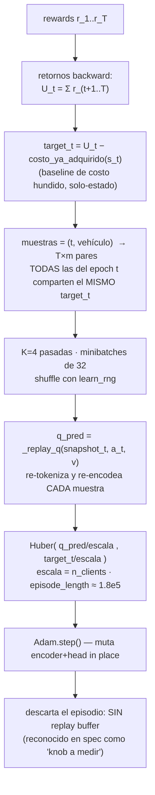
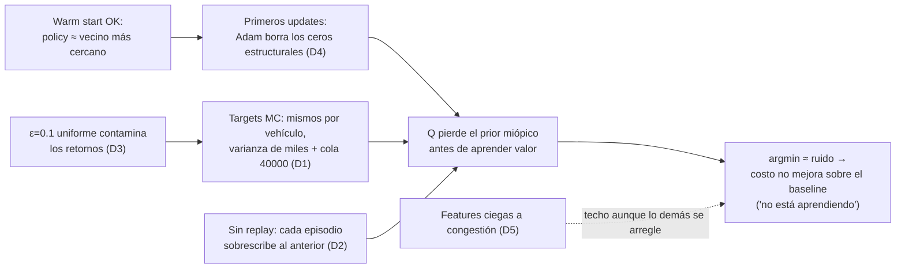

# Estudio de dominio: la policy Transformer del STDVRP y por qué podría no estar aprendiendo

> **Código estudiado:** rama `FEATURE_DEV_total_code_refactorization` @ `c875ef4` (worktree de solo lectura).
> **Archivos clave:** `src/stdvrp/policies/{tokenizer,network,transformer_policy}.py`,
> `src/stdvrp/training/{neural_episode,trainer}.py`, `experiments/chengdu/config.yaml`.
> **Fuentes:** ver `RESOURCES.md`; los flaws F1–F14 citados vienen de `docs/research/rl-methodology-for-stdvrp.md` (del propio repo).
> **Estado:** estudio de lectura, no un code review. El ultracode review lo corre Fernando.

---

## 1. El problema en una página

**STDVRP** = Stochastic Time-Dependent Vehicle Routing Problem con **eventos de congestión no
recurrentes**. `m` vehículos sirven ~150 clientes con ventanas de tiempo sobre el grafo vial de
Chengdu. Las velocidades son estocásticas y dependientes del tiempo; además se inyectan eventos
de congestión exógenos. El costo a minimizar es `distancia + earliness + delay + overtime`, más
una **penalización terminal de `40000 − 200·|visitados|`** si el reloj llega a 1198 min (F10).

Formulado como MDP:

- **Estado** `s_t`: posición de cada vehículo, clientes pendientes, reloj `tau`, velocidades observadas.
- **Acción** `a_t`: un vector conjunto — para cada vehículo, "próximo cliente o depot". Se decide
  **un vehículo a la vez en orden de índice** (descomposición one-agent-at-a-time, [Bertsekas](https://arxiv.org/abs/1910.00120)).
- **Recompensa** `r_{t+1}`: el costo incurrido en la transición (a minimizar).
- **Objetivo del aprendizaje**: `Q(s, v, a) ≈` costo-restante-del-episodio, y actuar con `argmin`.

La jugada de Fernando: reemplazar la VFA lineal de 19 features (`MonteCarloPolicy`, el baseline
congelado) por un **Transformer encoder + Q head**, manteniendo **exactamente la misma regla de
aprendizaje Monte Carlo** del baseline. Eso es una decisión deliberada (comparación pareada
contra el baseline), pero también significa que **hereda casi todos los flaws del baseline que
su propia investigación documentó** (F4, F10, F12…).

---

## 2. Cómo fluye una decisión (implementación actual)

### 2.1 Pipeline de inferencia

Puntos que están **bien resueltos** (vale decirlo antes de criticar):

- **Equivarianza por permutación**: los client_tokens van en el orden de `clients_not_visited`
  y la atención no depende del orden — la razón correcta para usar atención aquí.
- **Regla de observabilidad estructural** (ADR-0006): el tokenizer *no puede* ver
  `congested_arcs` ni el `TravelTimeModel` en `tau` — está pineado por test, no por promesa.
- **Factibilidad como restricción, no heurística** (ADR-0007): la máscara `claimed` con `+inf`
  antes del argmin; la legalidad nunca depende del output de la red.
- **Disciplina RNG**: 4 streams por episodio derivados de la seed del episodio (esto arregla el
  F5 del baseline para la ruta neuronal).
- **Normalización fija derivada del config** (no running stats) — preserva la reproducibilidad
  por seed que la comparación pareada necesita.

### 2.2 El warm start miópico (la parte más fina del diseño)

En la construcción, la red se inicializa para que `Q(v, j) == minutos_de_v_a_j / horizon`
**exactamente** — la policy sin entrenar es "vecino más cercano", no ruido:

1. Cada capa del transformer es **identidad exacta** en init (`out_proj` y `linear2` en cero,
   estilo zero-gamma de ResNet).
2. `arc_embed` fila 0 = `[1, 0]` → reconstruye los minutos.
3. `QHead.layer1` fila 0 lee solo esa dimensión; `layer2` lee solo esa unidad oculta.
4. Las filas/columnas "de fondo" quedan Xavier-random (no cero) para evitar el deadlock de
   gradiente que el docstring de `network.py` documenta con precisión.

Esto responde al F2 del baseline y sigue la recomendación F2/"myopic warm start" del research
note. **El diseño es correcto; la pregunta abierta es cuánto sobrevive al primer contacto con
Adam** (ver divergencia D4).

---

## 3. Cómo fluye el aprendizaje

### 3.1 El loop de entrenamiento

### 3.2 `learn()`: la regla Monte Carlo heredada

Detalle crítico del target: `target_t` es el **retorno global del episodio** desde `t` — el
mismo número para los `m` vehículos del epoch, sea cual sea la acción que cada uno tomó. La
única señal que distingue acciones es *correlacional a través de episodios*, no contrafactual.

---

## 4. Divergencias implementación vs. literatura

Ordenadas por mi estimación de probabilidad de explicar "no aprende". **(a)** = lo que la
fuente demuestra; **(b)** = inferencia mía sobre este repo.

| # | Divergencia | Qué hace el código | Qué dice la literatura | Severidad |
|---|---|---|---|---|
| **D1** | **Señal/ruido del target: sin crédito por acción** | `Q(s,v,a)` se regresa contra el retorno MC global `U_t` (miles, cola pesada por F10: penalización 40000). Las diferencias entre candidatos son de orden "minutos". | La varianza del retorno completo es el problema clásico del MC puro ([Sutton & Barto](http://incompleteideas.net/book/the-book-2nd.html) cap. 5–6; [Kearns & Singh](https://www.learningtheory.org/colt2000/papers/KearnsSingh.pdf)). Kool y POMO existen *para* reducir varianza con baselines por instancia; Chen/Ulmer/Thomas usan bootstrap DQN. El baseline de costo hundido aquí es solo-estado: reduce offset, no la varianza entre acciones. | **Crítica** |
| **D2** | **Sin experience replay entre episodios** | Un batch por episodio, K=4 pasadas sobre las MISMAS ~T·m muestras correlacionadas del episodio, luego se descartan. Cada episodio es una instancia distinta → interferencia catastrófica episodio a episodio. | Replay para decorrelar es uno de los dos estabilizadores canónicos ([Mnih et al. 2015](https://www.researchgate.net/publication/272837232_Human-level_control_through_deep_reinforcement_learning)); [Chen/Ulmer/Thomas](https://arxiv.org/abs/1910.11901) — el éxito más cercano a este problema — usa replay explícitamente. El spec lo reconoce como "knob a medir", no como riesgo de primer orden. | **Crítica** |
| **D3** | **ε fijo = 0.1, sin decay, uniforme sobre ~150 candidatos** | `decide_train` explora con prob. 0.1 por vehículo eligiendo uniforme entre TODOS los pendientes — un desvío casi siempre absurdo (cliente al otro lado de la ciudad) que contamina el retorno de TODO el episodio (el target de D1). | Chen/Ulmer/Thomas decaen ε 1.0→0.01; el propio research note lo marcó como F4 del baseline y la ruta neuronal lo heredó igual. Con targets MC (no bootstrap), una exploración mala a mitad de episodio envenena los targets de todos los epochs anteriores. | **Alta** |
| **D4** | **Adam vs. el warm start quirúrgico** | Pesos hechos a mano (ceros exactos + unos exactos) entrenados con Adam lr=3e-4. Adam normaliza por la magnitud del gradiente por-parámetro → los ceros estructurales (`out_proj`, `linear2`, columnas de fondo de `layer2`) se mueven ~lr en los primeros pasos: la identidad del transformer y el prior miópico pueden evaporarse en decenas de updates, ANTES de que exista señal de valor utilizable (D1+D2). | La init tipo zero-gamma viene del mundo supervisado con SGD/lr-warmup; nada en la literatura del warm start ([research note F2](../docs/research/rl-methodology-for-stdvrp.md)) lo valida bajo Adam con targets de alta varianza. (b) Verificable barato: correlación de `Q` con `minutos` tras N updates (Gate A ya mide calibración). | **Alta** |
| **D5** | **La red sigue parcialmente ciega a la congestión (F1 heredado)** | Los "arcos" `minutes_from_vehicle`/`path_length` vienen de `EpisodeGeometry` = promedios **estáticos** del CSV. Lo único dinámico que ve la red: `observed_velocity` (n escalares por vehículo) y los relojes. No hay congestión por arco del camino planificado ni estimación time-dependent. | El research note lo llama "the binding constraint" y lo rankea #1: "No RL estimator can learn to anticipate congestion from features that are congestion-blind". [Hildebrandt et al.](https://arxiv.org/abs/2103.00507) sobre granularidad de features. (b) Esto acota el techo: aunque D1–D4 se arreglen, el margen sobre el baseline lineal puede ser pequeño. | **Alta (techo)** |
| **D6** | **Escala del target vs. escala del warm start** | Init: `Q ∈ [0,1]` (minutos/horizon). Target escalado: `U_t/1.8e5 ≈ 0.03–0.25`. La red debe abandonar la escala del prior para perseguir la del retorno; tras converger en valor, todos los candidatos comparten `Q` casi idéntico y el argmin queda decidido por residuos (ver D1). | El escalado fijo es sano (misma disciplina que los tokens), pero la literatura estandariza el *target de aprendizaje* (min-max en Chen/Ulmer/Thomas; Pop-Art en deep RL) o aprende *ventajas* — no valores absolutos con offset gigante compartido. | **Media** |
| **D7** | **Descomposición por vehículo sin corrección** | Argmin secuencial con `claimed`; los targets no aíslan la contribución del vehículo. | [Hildebrandt et al.]: policies "coarse" porque "the decomposed actions are dependent". [Bertsekas Prop. 2.1](https://arxiv.org/abs/1910.00120): la MISMA descomposición es sólida si la evaluación interna es un rollout de la base policy. Idéntico al baseline → no explica "peor que el baseline", pero sí limita. | **Media** |
| **D8** | **Convergencia declarada sobre evaluation_seeds ruidosos** | Patience → 3 cortes de lr → "CONVERGED", sobre la media de pocos seeds con varianza enorme (F12: winner's curse ya documentado). Un run puede "converger" por ruido sin haber aprendido nada. | Selección de modelo sobre el mismo set que decide hiperparámetros ya lo marca el propio código como contaminado (anti-p-hacking del spec); el punto nuevo es que el *criterio de parada* también hereda esa varianza. | **Media** |
| **D9** | **Lo que NO es divergencia** | Sin target network (targets MC, no bootstrap → no se necesita); Huber en vez de MSE (razonable con colas F10); argmin de costo (convención consistente); re-encodear por muestra en `learn` (ineficiencia, no incorrectitud — documentada). | — | Informativa |

### La historia causal más plausible (b)

---

## 5. Preguntas afiladas para discutir con Fernando (y con su ultracode review)

1. **¿Qué muestra Gate A?** `calibration_pairs` ya existe: si la correlación (Q_pred, U_t) *sube*
   pero el costo greedy *no baja*, es evidencia directa de D1/D6 (aprende valor de estado, no
   ranking de acciones). Si ni la calibración sube, apunta a D2/D4.
2. **¿Sobrevive el warm start?** Medir `corr(Q(v,j), minutos(v,j))` en el checkpoint del episodio
   1, 10, 100. Si cae a ~0 en decenas de episodios, D4 confirmado barato.
3. **¿Qué pasa con ε=0 puro?** Un run corto sin exploración aísla D3.
4. **¿El loss (`last_loss`) baja mientras el costo no?** Loss bajando + costo plano = la firma
   de D1 (el target es aprendible; el ranking no está en el target).
5. **¿Por qué targets MC y no n-step/TD con el reward por transición que ya se captura?**
   (La infraestructura `rewards[t+1]` ya está; es la palanca más directa contra D1.)

---

## 6. Glosario mínimo

| Término | Significado aquí |
|---|---|
| **Decision epoch** | Instante en que algún vehículo necesita nuevo destino; se decide la acción conjunta. |
| **Sweep** | El loop por vehículo (orden de índice) que puntúa candidatos con el QHead compartiendo una pasada del encoder. |
| **VFA** | Value Function Approximation — lineal (baseline, 19 features) o neuronal (esta rama). |
| **Retorno backward `U_t`** | Suma de rewards desde t hasta el final del episodio, calculada hacia atrás. |
| **Costo ya adquirido** | Baseline de costo hundido (delay ya incurrido + overtime ya incurrido) restado del target; depende solo del estado. |
| **Warm start miópico** | Inicialización exacta de la red para que Q = minutos de viaje (policy inicial = vecino más cercano). |
| **Claimed** | Cliente ya reclamado por un vehículo anterior en el mismo sweep (invariante B11: sin doble asignación). |
| **Reference card** | Vector congelado de costos por seed del baseline lineal, para comparación pareada. |
| **Gate A** | Chequeo del ticket 08: modelo nulo, reproducibilidad y calibración (Q predicho vs. U realizado). |

---

*Documento del workspace de enseñanza (ver `MISSION.md`). Preguntas y profundizaciones: pedirlas
al agente en la sesión — cada divergencia D1–D8 puede convertirse en una lección propia.*
